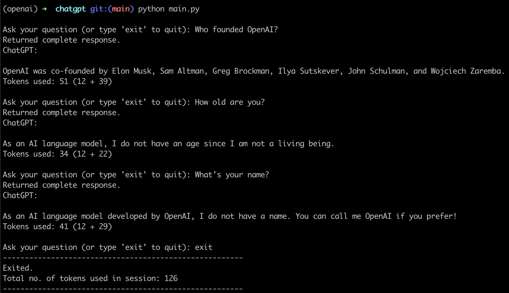

A ChatGPT CLI tool.

### Usage
1. Store your OpenAI API key in a new file config.py inside a variable APIKEY.
2. ```bash
    pip install -r requirements.txt
    ```
3. ```bash
    python3 main.py
    ```

Currently using the model **"gpt-3.5-turbo"**. \
E.g.
