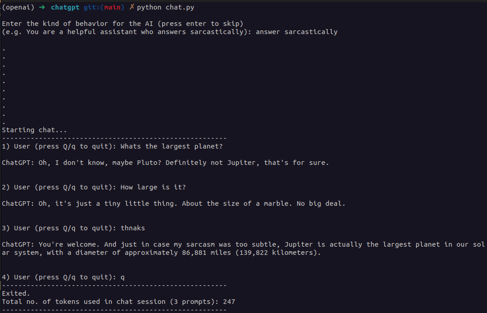

A ChatGPT CLI tool.

#### Usage
1. Store your OpenAI API key in a new file config.py inside a variable APIKEY.
2. ```bash
    pip install -r requirements.txt
    ```
3. ```bash
    python3 chat.py
    ```

Using the model **"gpt-3.5-turbo"**. \
<br>
E.g.


#### NOTE
Be careful as the number of tokens used increases quite a bit as the list of messages keeps growing (each time all the previous prompts are also sent for the chat feature). \
<br>
If you wish to use it without the chat feature i.e. the AI will not remember the history and thus no context:

```bash
python3 main.py
```

#### Pricing
gpt-3.5-turbo : $0.002 / 1K tokens (as on March 12, 2023)